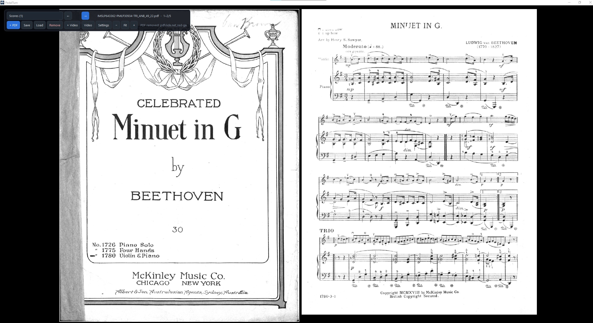
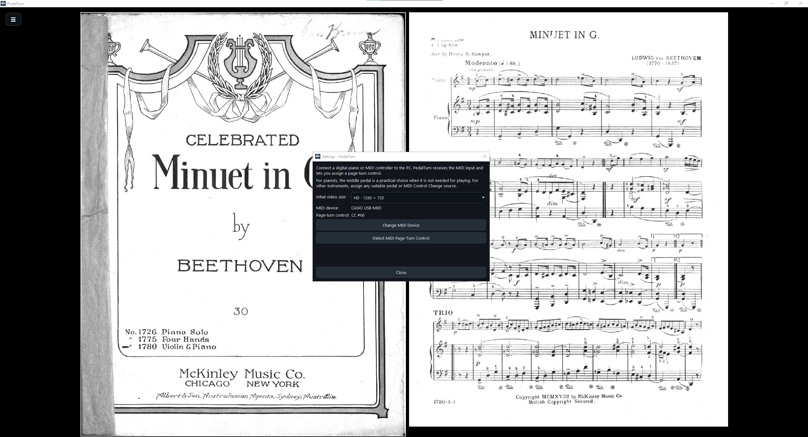

<p align="center">
  
</p>

<h1 align="center">PedalTurn</h1>

<p align="center">
  Hands-free score page turning with MIDI pedals and controllers.
</p>

<p align="center">
  
  
  
</p>

## Overview

PedalTurn is a modern, distraction-free score viewer designed for musicians who need reliable hands-free page turning while performing.

It is not limited to piano. It can be used with a digital piano, MIDI keyboard, MIDI controller, or another MIDI-capable setup that provides a suitable page-turn control.

PedalTurn combines:

- High-quality PDF score rendering
- Two-page spread viewing
- MIDI Control Change page turning
- Optional video playback linked to each score
- Floating controls that automatically hide while playing
- Playlist management for multiple scores
- Versioned `.vdp` project files

The application uses a modular architecture that separates the UI, application orchestration, navigation rules, and media services.

## Who Needs PedalTurn?

PedalTurn requires a MIDI-capable device connected to your computer.

Typical setups include:

- A digital piano with MIDI/USB connected to the PC
- A MIDI keyboard or controller connected to the PC
- A MIDI foot pedal connected to the PC or routed through a MIDI controller

The MIDI device must appear as an input device that PedalTurn can select.

### For Pianists

With a three-pedal digital piano, the middle pedal is a practical choice for page turning when it is not needed for the performance.

The setup is:

1. Connect the digital piano to the PC through its MIDI/USB connection.
2. Open **Settings** in PedalTurn.
3. Select the digital piano from the available MIDI input devices.
4. Choose **Detect MIDI Page-Turn Control**.
5. Press the pedal you want to use.
6. PedalTurn detects the MIDI Control Change number and assigns it to page turning.

The middle pedal is only a recommendation for pianists. The user can choose another suitable control depending on the instrument and performance setup.

### For Other Instruments

PedalTurn can be used by guitarists, violinists, singers, wind players, and other musicians.

It can also be useful outside live performance whenever hands-free score navigation is helpful.

Simply connect a compatible MIDI controller or pedal and assign the control you want to use for page turning.

The important requirement is that the selected control sends a MIDI Control Change (CC) message that PedalTurn can detect.

Some MIDI controllers can also map physical keys or other controls to a MIDI CC. When configured that way, those controls can be used for page turning as well.

## Screenshots

<p align="center">
  
</p>

<p align="center">
  
</p>

## Highlights

### Distraction-free score view

The score occupies the available window with minimal visual distraction. The control panel floats over the viewer and automatically hides after 3.5 seconds.

Press `Esc` to bring the controls back instantly.

### Reliable MIDI page turning

The page-turn trigger is edge-triggered, so holding a pedal down does not repeatedly advance pages.

MIDI Control Change messages are accepted independently of MIDI channel.

### Score playlist

Load multiple PDF scores and switch between them from a compact floating playlist. Each entry can show its current, video-linked, or missing-file state.

### Video playback

Attach one video to each PDF score. Video playback is optional and is not limited to performance use. It can also be useful for rehearsals, tutorials, demonstrations, reference material, backing content, visual guidance, or any other workflow where a video needs to stay associated with a score.

Videos play in a separate Qt Multimedia window, loop automatically, preserve aspect ratio, and remember their last window position.

## Features

| Area | Features |
| --- | --- |
| PDF | Two-page spreads, aspect-ratio preservation, page navigation, zoom, LRU page cache |
| MIDI | Device discovery, device selection, automatic CC detection, channel-independent CC handling, press-edge triggering |
| Video | MP4/AVI/MOV/MKV/WebM support depending on the installed Qt Multimedia backend, looping playback, persistent window position |
| Projects | Save and restore complete PDF playlists, optional video associations, version 2 `.vdp` format with legacy project compatibility |
| UI | PySide6 / Qt 6, dark theme, floating controls, auto-hide behavior, no Tkinter |
| Reliability | No global application state, clean PDF/MIDI/video shutdown, duplicate-PDF prevention |

## Requirements

- Windows 10 or Windows 11
- Python 3.10 or newer
- A MIDI-capable input device connected to the computer
- Qt Multimedia-compatible codecs/backend for video formats that require them

A MIDI device is required for pedal-based page turning. PDF viewing itself does not require a MIDI device.

## Quick Start

Clone the repository, then run:

```bat
run.bat
```

## Controls

| Action | Shortcut / Control |
| --- | --- |
| Next spread | `Right Arrow` or assigned MIDI control |
| Previous spread | `Left Arrow` |
| Show controls | `Esc` |
| Zoom in/out | `Ctrl + Mouse Wheel` |
| Fit to screen | Floating control: **Fit** |

## MIDI Setup

1. Connect your digital piano, MIDI keyboard, MIDI controller, or MIDI pedal to the PC.
2. Open **Settings**.
3. Select the MIDI input device that appears in PedalTurn.
4. Click **Detect MIDI Page-Turn Control**.
5. Press the pedal or other MIDI control you want to assign.
6. PedalTurn stores the detected Control Change number in `config.json`.

For pianists using a three-pedal digital piano, the middle pedal is often the most convenient choice when it is not required for the performance.

For other instruments, use whichever pedal or MIDI control best fits your setup.

If your MIDI controller allows physical keys or other controls to be mapped to MIDI Control Change messages, those mapped controls can also be assigned.

## Saved Score Playlists

PedalTurn can save an entire score playlist as a `.vdp` project file. This means you do not need to select every PDF again each time you use the application.

A saved project can contain:

- Multiple PDF scores in a specific order
- An optional video associated with each score
- The paths required to restore the playlist later

The workflow is simple:

1. Add the PDF scores you want.
2. Organize them in the playlist.
3. Save the playlist as a `.vdp` project.
4. Load the project later to restore the configured score list instead of selecting every PDF again.

The current project format is versioned:

```json
{
  "version": 2,
  "items": [
    {
      "pdf": "C:\\Scores\\Example.pdf",
      "video": "C:\\Videos\\Example.mp4"
    }
  ]
}
```

Older projects that use `pdf_queue` and `video_map` remain readable.

## Configuration

`config.json` stores:

- Video window width and height
- Selected MIDI device name
- MIDI page-turn Control Change number
- Saved video window position

When running from Python, configuration is resolved from the project directory. When running as a packaged executable, it is resolved next to the executable.

## Architecture

```text
PedalTurn/
├── pdf_page_changer/
│   ├── core/           # Domain models and navigation rules
│   ├── controllers/    # Application orchestration
│   ├── services/       # PDF, MIDI, media, config, project services
│   ├── ui/             # Qt windows, dialogs, viewer and styling
│   ├── utils/          # Application paths
│   └── main.py         # Application entry point
├── PageChangerPiano.py # Application launcher
├── requirements.txt    # Python dependencies
├── docs/               # README screenshots
│   ├── Screenshot1.jpg
│   └── Screenshot2.jpg
├── icono.ico           # Application icon
└── README.md           # Project documentation
```

## Technology

- **Python**
- **PySide6 / Qt 6**
- **PyMuPDF**
- **Pygame MIDI**
- **Qt Multimedia**
- **PyInstaller**

## Project Status

PedalTurn is built as a modular application with a dedicated UI layer and separate PDF, MIDI, media, configuration, and project services.
